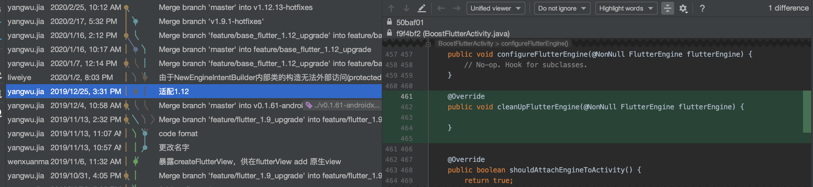

# FlutterActivity载体分析

Boost在处理Flutter载体时，基于Flutter提供的载体做了二次开发，同时为了满足某些修改，对部分源码进行了整体拷贝+修改。这带来了一个问题，存在较大的版本兼容风险，同时对开发者来说，Boost改造后的载体其实很难与原生载体作区分。

这一节我们在分析改造后的Flutter载体时，将横向对照原载体，这样可以将Boost做的个性化的关键点提取出来。

## 载体启动分析
* BoostFlutterActivity.java
* FlutterActivity.java

新增：
* NewEngineIntentBuilder调整加入url配置
* NewEngineIntentBuilder调整加入params配置
* 载体加入getContainerUrl
*载体加入getContainerUrlParams

修改：
* NewEngineIntentBuilder调整destroy_engine_with_activity默认值，由true改为false

> Flutter目前还提供了具备复用能力的CachedEngineIntentBuilder，针对每个引擎对象，提供了对应的engineid

删除：
* 取消页面销毁回调lifecycle.handleLifecycleEvent(Lifecycle.Event.ON_DESTROY);

除了上述差异外，Activity载体还有很多差异，主要集中在FlutterActivity有很多API是Boost不具备的。两者差异已经比较大。这也印证了他的风险，通过整体拷贝做定制会导致碎片化和版本对齐的适配工作。

那么Boost是如何做的版本适配呢？我们以从1.9到1.12为例看一下提交记录：

可以推断的是，Boost在这个版本放弃了全面对齐，仅仅做了最Error级别的API不兼容适配。